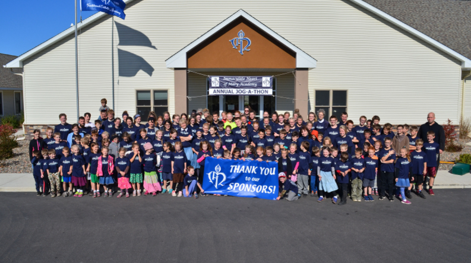
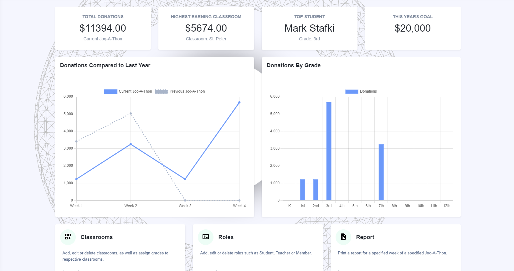
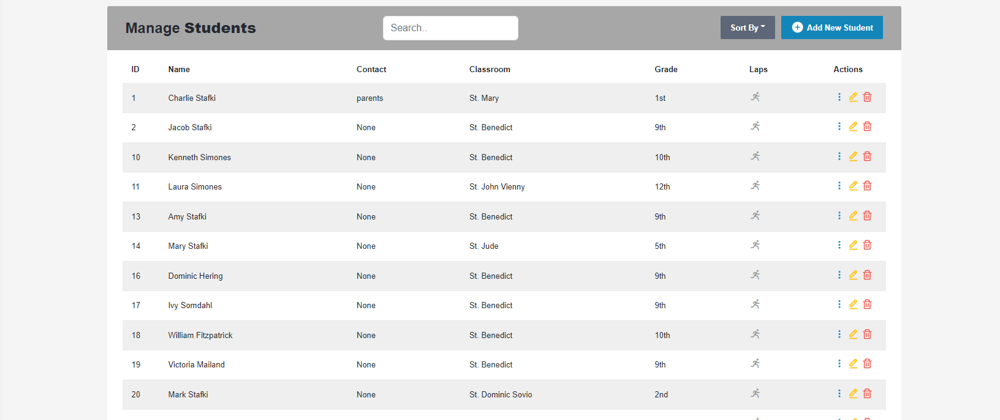
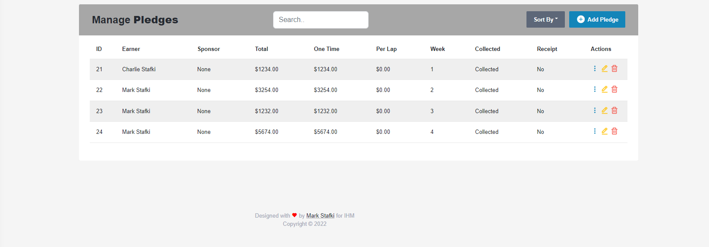
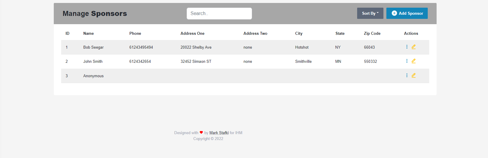
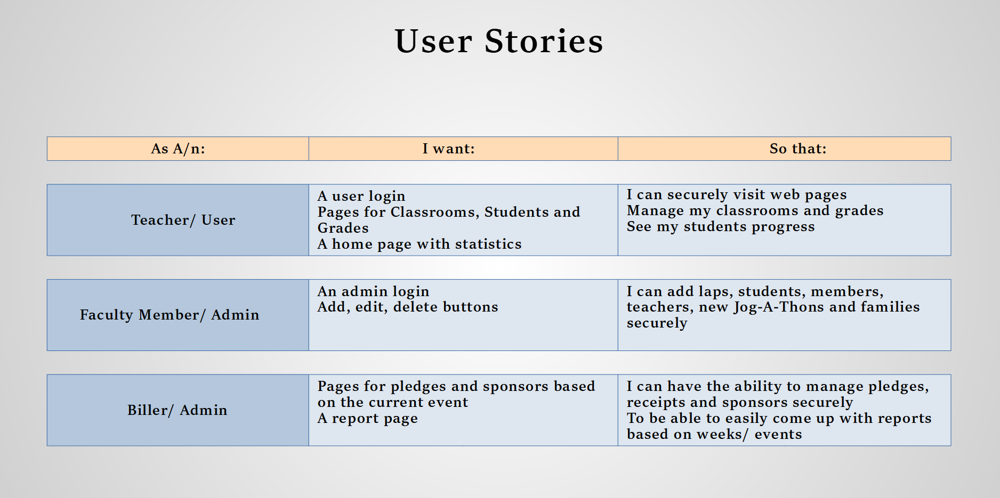

# _**IHM Jog-A-Thon Tracker**_ ([Demo](https://cryptic-meadow-44357.herokuapp.com/index))
### A README about the creation of my Jog-a-thon/ event tracker, built for data collection, statistics and donation reports.

## What is a Jog-A-Thon?

### A Jog-A-Thon is a fundraiser held at a small private [school](https://ihm-academy.com/en) to help with tuition, operating and teacher employment costs. At the start date the students work to gather donations in preparation for the final date, where students can win prizes after jogging as many times as they can in an hour around a 1/4 mile track.

# _A Jog-A-Thon consists of:_
* ### Pledges
* ### Students
* ### Laps
* ### The Event
* ### And More

## _A Quick Look_

# _User Stories_

### Having had the privilege of collaborating with school's DBA as well as a connections with the staff, I was able to craft some user stories.

# _Technical Challenges_

### Overcoming [Spring Security](https://github.com/marstafk0/Bootcamp-Projects/tree/main/TEKsystems%20Projects/Java/IHMtrackerTool/src/main/java/com/marstafk/IHMtrackerTool/security) and Roles
Security for my application is important, I need at least two roles: USER and ADMIN, allowing users to see data and admins to create, read, update and delete. Having no prior experience in Spring Security it was a huge challenge, but after countless hours of self learning I came up with a system that works well and handles validation such as certain size fields and duplicate entries.

### [Modal](https://github.com/marstafk0/Bootcamp-Projects/tree/main/TEKsystems%20Projects/Java/IHMtrackerTool/src/main/resources/templates) and Pre-filled Data

This one was fun, modals allow for quick, easy, clean forms for, in my case, adding, editing and deleting. I used a lot of [JQuery](https://github.com/marstafk0/Bootcamp-Projects/blob/main/TEKsystems%20Projects/Java/IHMtrackerTool/src/main/resources/static/js/main.js) for this, specifically for pre-filling data. I used get mappings to return a response body on a button click and list whatever I needed. Seems simple but quite elegant and complex.

## _Conclusion_

I had a crazy time doing this project and I loved every minute of it. The complexity and scale was a huge challenge, but every time I succeeded it felt better than the last. Thank you for visiting and enjoying my work.

### Connect
* [LinkedIn](https://www.linkedin.com/in/markstafki/)
* [GitHub](https://github.com/marstafk0)
* [Twitter](https://twitter.com/MarkStafki)
* [StackOverFlow](https://stackoverflow.com/users/18022367/marstafk-0)
* [HackerRank](https://www.hackerrank.com/mark_stafki)
